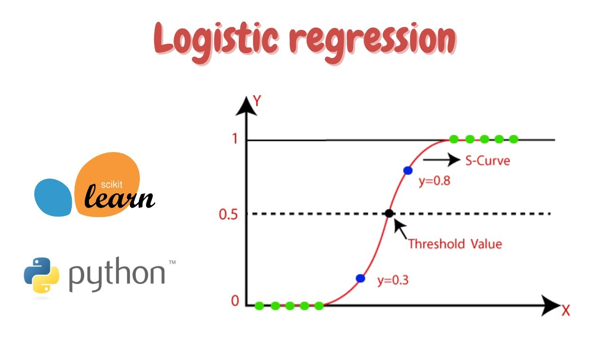
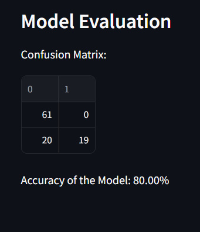
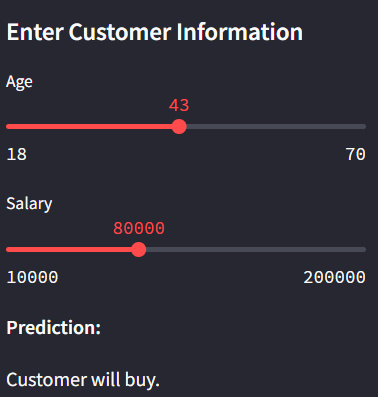

Sale Prediction from Existing Customer - Logistic Regression's documentation!
====================================================================================================================

Project Overview
-------------------------------------------------------------

This project implements a web application for predicting whether a customer will buy a product based on their age and salary.  It utilizes logistic regression, a machine learning algorithm, to make predictions.

Results
-------------------------------------------

\# Test the Model

