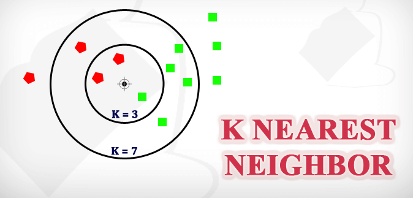
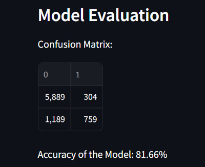
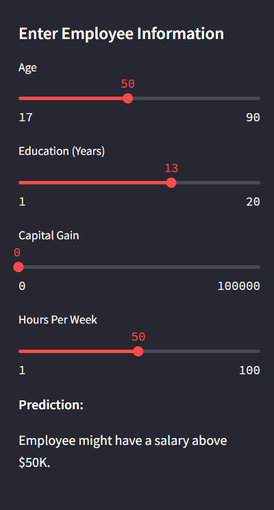

Salary Estimation Using KNN’s documentation
====================================================================================================================

Project Overview
-------------------------------------------------------------

This project aims to estimate the salary of an employee based on various factors such as age, education, capital gain, and hours worked per week. It utilizes the K-Nearest Neighbors (KNN) algorithm to make predictions.

Results
-------------------------------------------

\# Test the Model

