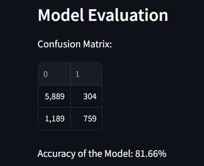

  Salary Estimation Using KNN’s documentation! — Salary Estimation Using KNN 2024 documentation     

Salary Estimation Using KNN’s documentation
====================================================================================================================

Project Overview[¶](#project-overview "Link to this heading")
-------------------------------------------------------------

This project aims to estimate the salary of an employee based on various factors such as age, education, capital gain, and hours worked per week. It utilizes the K-Nearest Neighbors (KNN) algorithm to make predictions.

K-Nearest Neighbors Code[¶](#k-nearest-neighbors-code "Link to this heading")
-----------------------------------------------------------------------------

\# Import necessary libraries
import streamlit as st
import pandas as pd
import numpy as np
from sklearn.model\_selection import train\_test\_split
from sklearn.neighbors import KNeighborsClassifier
from sklearn.preprocessing import StandardScaler
from sklearn.metrics import confusion\_matrix, accuracy\_score
import matplotlib.pyplot as plt

\# Load Dataset
@st.cache\_data
def load\_data():
    return pd.read\_csv('C:/Users/USER/Documents/My GitHub Folder/Machine Learning Project/Machine-Learning-Projects/1. Supervised Learning/2. K-Nearest Neighbour/salary.csv')

\# Summarize Dataset
def summarize\_data(data):
    st.write("Shape of dataset:", data.shape)
    st.write("Head of dataset:", data.head())

\# Map Salary Data to Binary Value
def map\_salary\_to\_binary(data):
    data\['income'\] \= data\['income'\].map({'<=50K': 0, '>50K': 1}).astype(int)
    return data

\# Preprocess data and train the model
def preprocess\_and\_train(data):
    X \= data.iloc\[:, :\-1\].values
    Y \= data.iloc\[:, \-1\].values
    X\_train, X\_test, y\_train, y\_test \= train\_test\_split(X, Y, test\_size\=0.25, random\_state\=0)
    sc \= StandardScaler()
    X\_train \= sc.fit\_transform(X\_train)
    X\_test \= sc.transform(X\_test)
    model \= KNeighborsClassifier(n\_neighbors\=22, metric\='minkowski', p\=2)
    model.fit(X\_train, y\_train)
    return model, X\_test, y\_test, sc

\# Predict based on user input
def predict(model, sc, age, education, capital\_gain, hours\_per\_week):
    new\_employee \= \[\[age, education, capital\_gain, hours\_per\_week\]\]
    scaled\_data \= sc.transform(new\_employee)
    prediction \= model.predict(scaled\_data)
    if prediction \== 1:
        return "Employee might have a salary above $50K."
    else:
        return "Employee might not have a salary above $50K."

\# Main function
def main():
    st.title('Salary Estimation - K-Nearest Neighbors')

    \# Load data
    data \= load\_data()

    \# Summarize data
    st.subheader('Dataset Summary')
    summarize\_data(data)

    \# Map salary data to binary value
    data \= map\_salary\_to\_binary(data)

    \# Preprocess data and train model
    model, X\_test, y\_test, sc \= preprocess\_and\_train(data)

    \# Sidebar for user input
    st.sidebar.header('Enter Employee Information')
    age \= st.sidebar.slider('Age', min\_value\=17, max\_value\=90, value\=30, step\=1)
    education \= st.sidebar.slider('Education (Years)', min\_value\=1, max\_value\=20, value\=10, step\=1)
    capital\_gain \= st.sidebar.slider('Capital Gain', min\_value\=0, max\_value\=100000, value\=0, step\=1000)
    hours\_per\_week \= st.sidebar.slider('Hours Per Week', min\_value\=1, max\_value\=100, value\=40, step\=1)

    \# Predict based on user input
    prediction \= predict(model, sc, age, education, capital\_gain, hours\_per\_week)
    st.sidebar.markdown('\*\*Prediction:\*\*')
    st.sidebar.write(prediction)

    \# Predictions for all test data
    st.subheader('Predictions for Test Data')
    y\_pred \= model.predict(X\_test)
    prediction\_data \= np.column\_stack((y\_pred, y\_test))
    st.write(pd.DataFrame(prediction\_data, columns\=\['Predicted', 'Actual'\]))

    \# Evaluate model - Confusion Matrix and Accuracy
    st.subheader('Model Evaluation')
    cm \= confusion\_matrix(y\_test, y\_pred)
    accuracy \= accuracy\_score(y\_test, y\_pred)
    st.write('Confusion Matrix:')
    st.write(cm)
    st.write('Accuracy of the Model: {:.2f}%'.format(accuracy \* 100))

if \_\_name\_\_ \== '\_\_main\_\_':
    main()

Results[¶](#results "Link to this heading")
-------------------------------------------

\# Test the Model

[Salary Estimation Using KNN](#)
================================

### Navigation

### Related Topics

*   [Documentation overview](#)
    

### Quick search

 

document.getElementById('searchbox').style.display = "block"

©2024, Temcious. | Powered by [Sphinx 7.2.6](https://www.sphinx-doc.org/) & [Alabaster 0.7.16](https://alabaster.readthedocs.io) | [Page source](_sources/index.rst.txt)