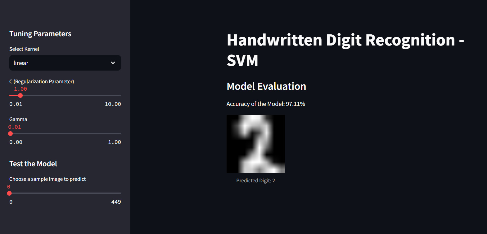

.. Handwritten Digit Recognition - SVM documentation master file, created by
   sphinx-quickstart on Sun Apr 14 18:47:50 2024.
   You can adapt this file completely to your liking, but it should at least
   contain the root `toctree` directive.

Handwritten Digit Recognition - SVM's documentation!
==================================================================

.. toctree::
   :maxdepth: 2
   :caption: Contents:

Project Overview
-------------------
This project focuses on recognizing handwritten digits using Support Vector Machine (SVM) algorithm. 
Handwritten digit recognition is a classic problem in the field of machine learning and computer vision, 
with applications ranging from digitizing handwritten documents to automatic address reading in postal services.

Support-Vector-Machine Code
--------------------------------

.. literalinclude:: C:/Users/USER/Documents/My GitHub Folder/Machine Learning Project/Machine-Learning-Projects/1. Supervised Learning/3. Handwritten Digit Recognition - SVM/Handwritten Digit Recognition .py
   :language: python

Results
-------

