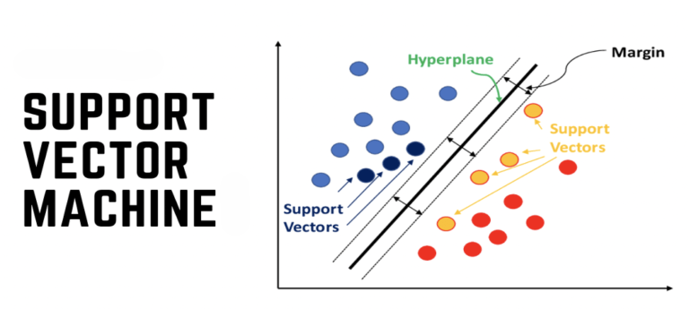

Handwritten Digit Recognition - SVM
====================================================================================================================

Project Overview
-------------------
This project focuses on recognizing handwritten digits using Support Vector Machine (SVM) algorithm. 
Handwritten digit recognition is a classic problem in the field of machine learning and computer vision, 
with applications ranging from digitizing handwritten documents to automatic address reading in postal services.

Results
-------------------------------------------

