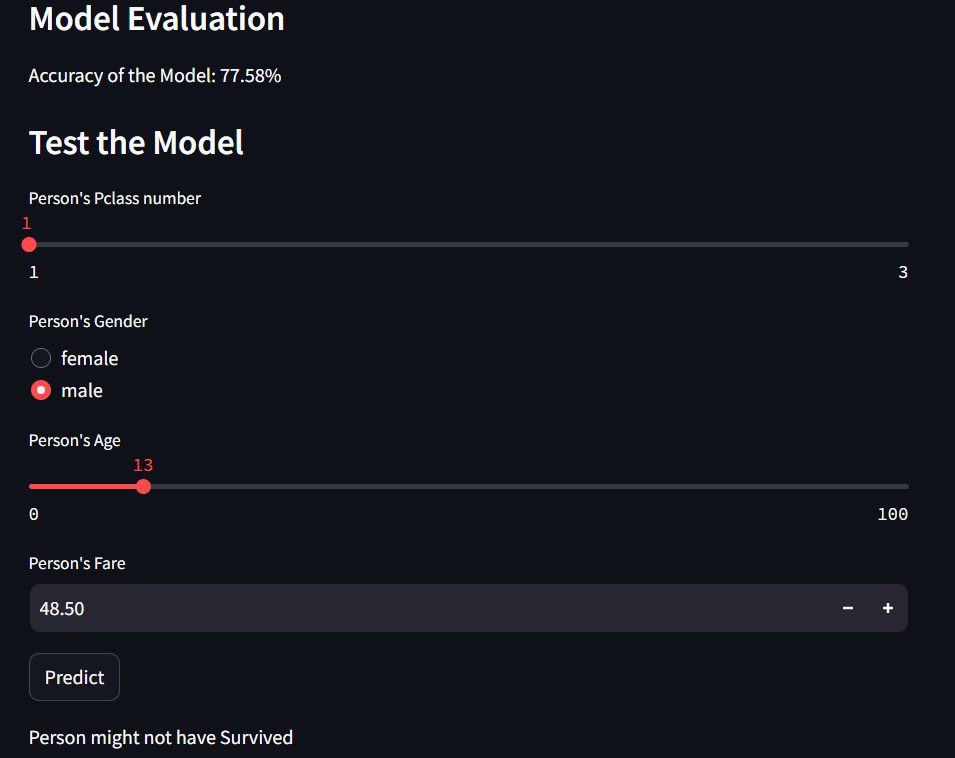

Titanic Survival Prediction - Naive Bayes
====================================================================================================================

Project Overview
-------------------

The Titanic Survival Prediction project aims to predict whether a passenger aboard the Titanic survived or not using the Naive Bayes algorithm. This project is based on the famous Titanic dataset, which contains information about passengers such as their age, gender, class, fare, and survival status. The goal is to build a predictive model that can accurately classify passengers into survived or not survived categories based on their attributes.

Results
-------------------------------------------

\# Test the Model

