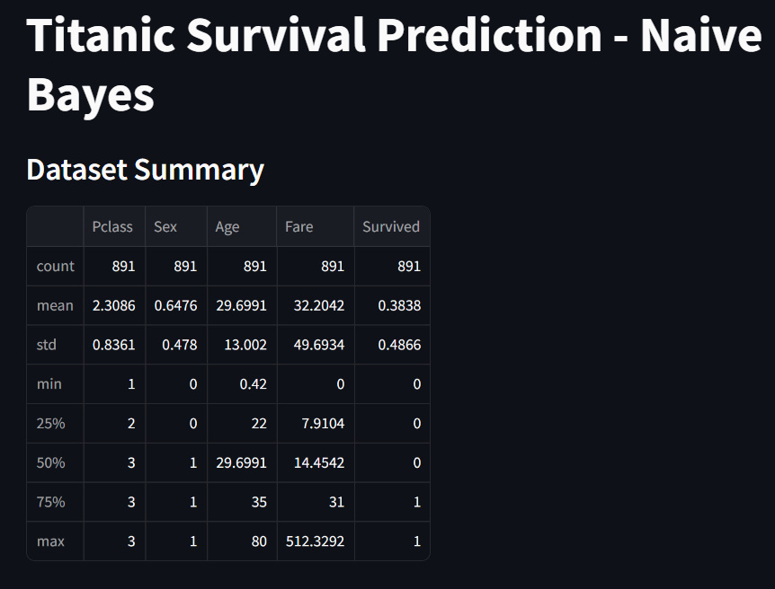
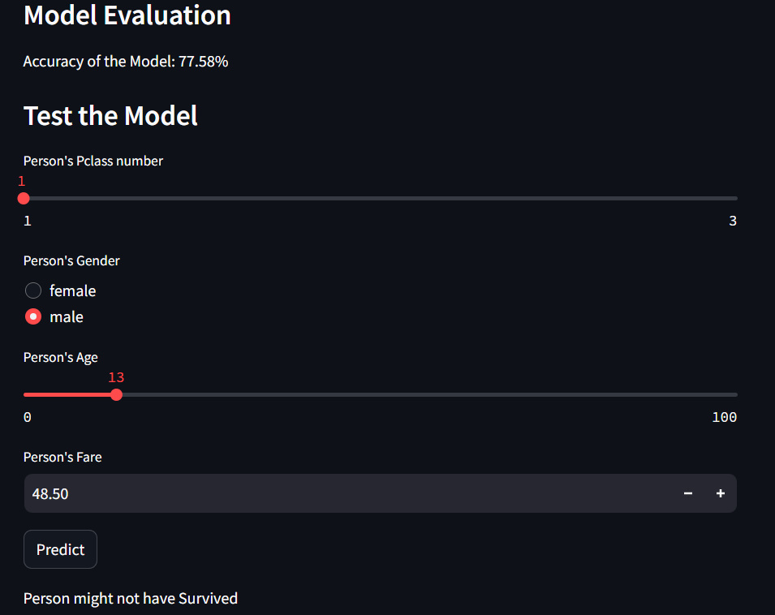

.. Titanic Survival Prediction - Naive Bayes documentation master file, created by
   sphinx-quickstart on Sun Apr 14 19:28:45 2024.
   You can adapt this file completely to your liking, but it should at least
   contain the root `toctree` directive.

Titanic Survival Prediction - Naive Bayes
=====================================================================

.. toctree::
   :maxdepth: 2
   :caption: Contents:

Project Overview
-------------------

The Titanic Survival Prediction project aims to predict whether a passenger aboard the Titanic survived or not using the Naive Bayes algorithm.
This project is based on the famous Titanic dataset, which contains information about passengers such as their age, gender, class, fare, and survival status. 
The goal is to build a predictive model that can accurately classify passengers into survived or not survived categories based on their attributes.

.. image:: NB.jpg
   :alt: Naive Bayes
   :align: center

Naive Bayes Code
--------------------------------

.. literalinclude:: C:/Users/USER/Documents/My GitHub Folder/Machine Learning Project/Machine-Learning-Projects/1. Supervised Learning/4. Naive Bayes/Titanic Survival Prediction.py
   :language: python

Results
----------

# Test the Model

