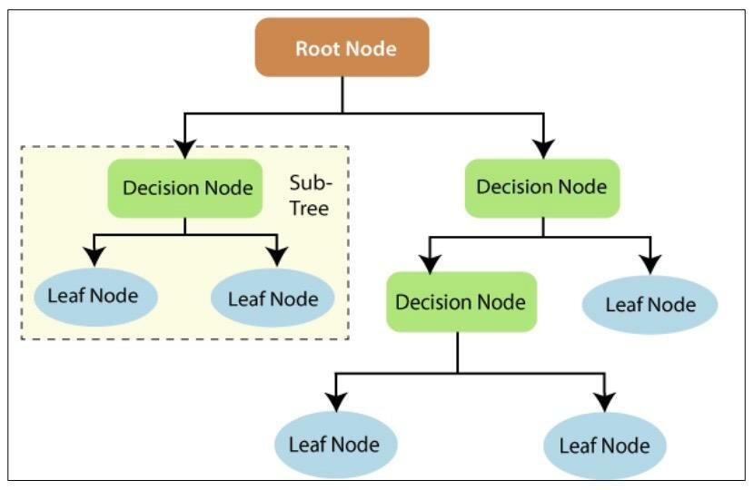
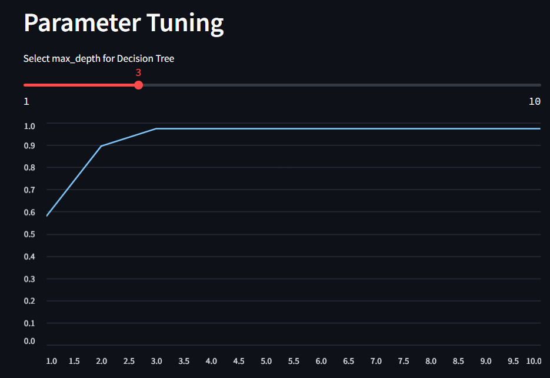
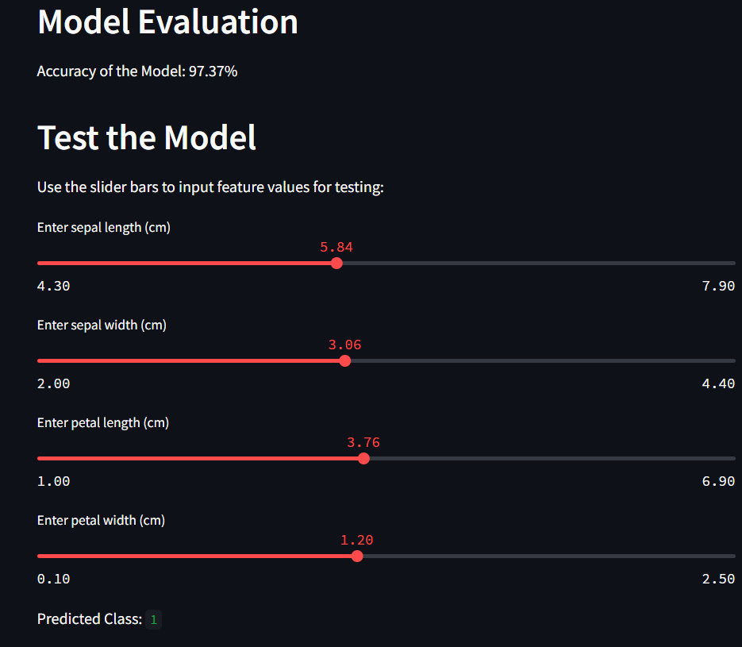

.. Leaf Species Detection with Decision Trees documentation master file, created by
   sphinx-quickstart on Tue Apr 16 16:17:10 2024.
   You can adapt this file completely to your liking, but it should at least
   contain the root `toctree` directive.

Leaf Species Detection - Decision Trees
======================================================================

.. toctree::
   :maxdepth: 2
   :caption: Contents:

Project Overview
-------------------
The Leaf Species Detection with Decision Trees project is designed to classify different species of leaves using the Decision Tree algorithm.
It utilizes the Iris dataset, a well-known dataset containing features of iris flowers such as sepal length, sepal width, petal length, and petal width, along with their corresponding species labels.
The objective is to train a Decision Tree model that can effectively classify the species of a leaf based on its features.
The project offers an interactive web interface where users can explore the dataset, adjust model parameters, train the model, evaluate its accuracy, and make predictions on new data.

Decision Tree Code
--------------------------------

.. literalinclude:: C:/Users/USER/Documents/My GitHub Folder/Machine Learning Project/Machine-Learning-Projects/1. Supervised Learning/5. Decision Tree/Leaf Species Detection .py
   :language: python

Results
----------

# Test the Model

