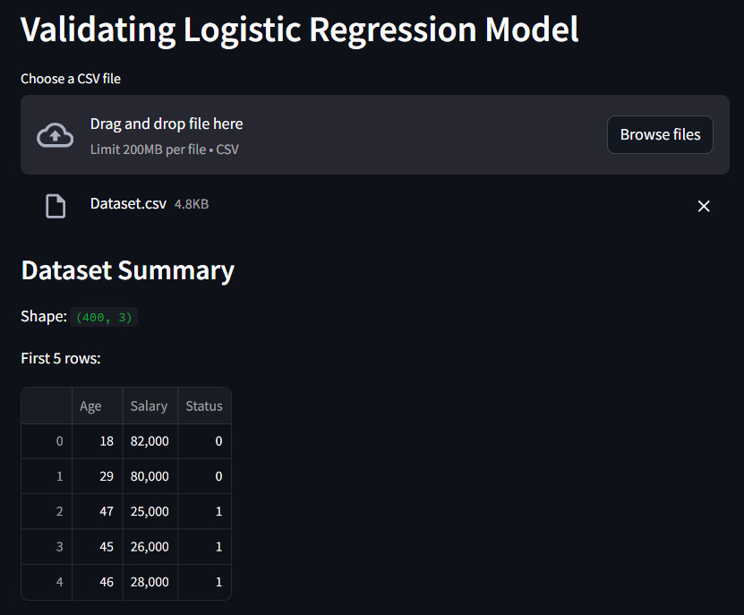
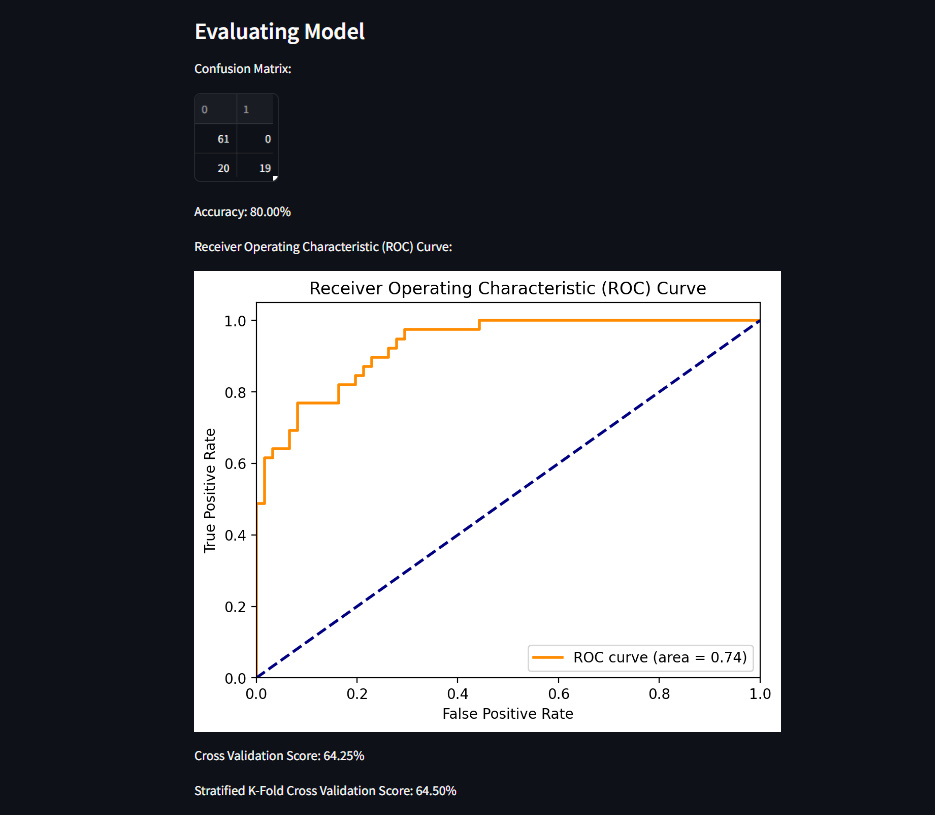

Classification Model Evaluation - Logistic Regression
===========================================================

Project Overview
-------------------
The "Sale Prediction from Existing Customer" project validates a Logistic Regression model for predicting sales from existing customers. 
It offers a user-friendly interface to upload a CSV file, displays dataset summaries, trains the model, and evaluates its performance using metrics like accuracy, ROC curve, and cross-validation scores.

Results
-------------------------------------------

