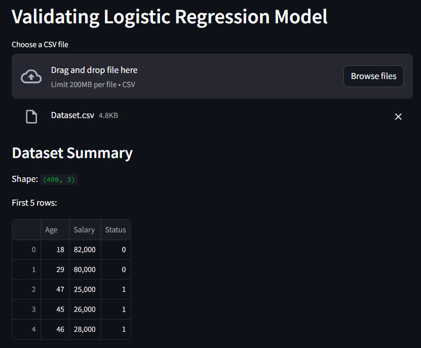
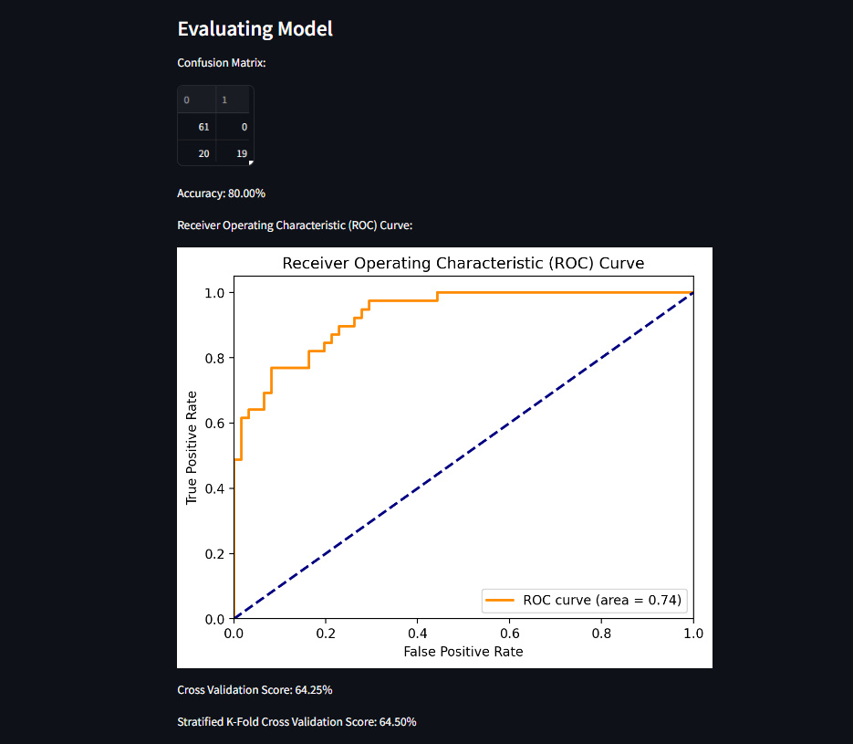

.. Classification Model Evaluation documentation master file, created by
   sphinx-quickstart on Wed Apr 17 18:22:54 2024.
   You can adapt this file completely to your liking, but it should at least
   contain the root `toctree` directive.

Classification Model Evaluation
===========================================================

.. toctree::
   :maxdepth: 2
   :caption: Contents:

Project Overview
-------------------
The "Sale Prediction from Existing Customer" project validates a Logistic Regression model for predicting sales from existing customers. 
It offers a user-friendly interface to upload a CSV file, displays dataset summaries, trains the model, and evaluates its performance using 
metrics like accuracy, ROC curve, and cross-validation scores.

Logistic Regression Code
--------------------------------

.. literalinclude:: C:/Users/USER/Documents/My GitHub Folder/Machine Learning Project/Machine-Learning-Projects/1. Supervised Learning/7. Evaluating Classification Model Performance/Evaluation.py
   :language: python

User interface
--------------

Results
----------

