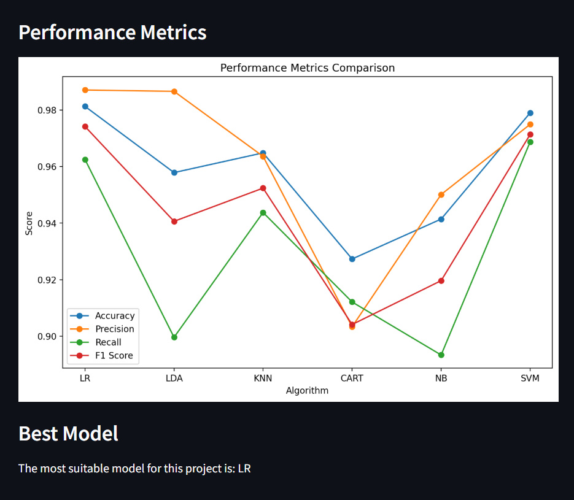

Breast Cancer Detection using Various Machine Learning Algorithms
=============================================================================================

Project Overview
-------------------

The "Breast Cancer Detection" project evaluates multiple machine learning models using a dataset.
It preprocesses the data, trains various models including Logistic Regression, Linear Discriminant Analysis, 
K-Nearest Neighbors, Decision Tree, Gaussian Naive Bayes, and Support Vector Machine. The project assesses the 
models' performance using metrics like accuracy, precision, recall, and F1 score. 
Finally, it identifies the best-performing model for breast cancer detection and presents the results in a user-friendly interface.

Results
-------------------------------------------

