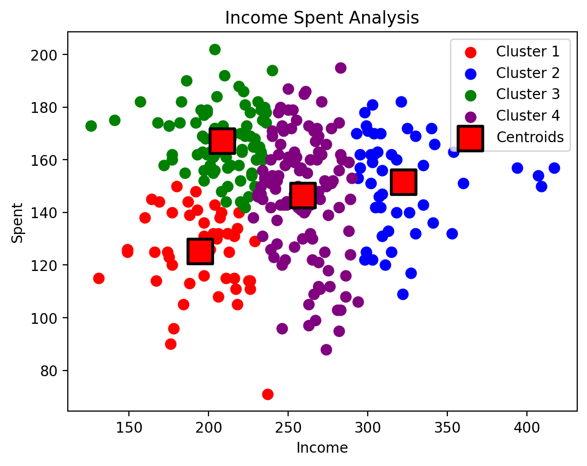

Customer Spent Analysis using K-Means Clustering
==================================================

Project Overview:
-------------------
The "Customer Spent Analysis using K-Means Clustering" project utilizes K-Means clustering to segment customers based on income and spending patterns. 
It employs Streamlit for the interface, pandas for data manipulation, and scikit-learn for model training. 
The optimal number of clusters is determined using the within-cluster sum of squares (WCSS) metric. 
The resulting clusters are visualized, and users can input their data for cluster prediction.

Optimal K Value Selection
--------------------------

Result
-------

Testing
--------

