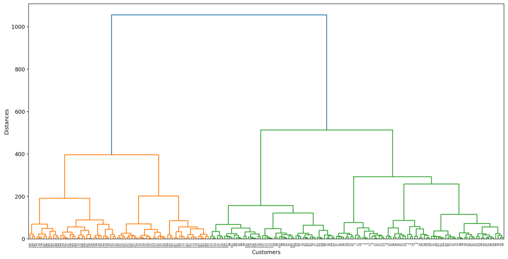
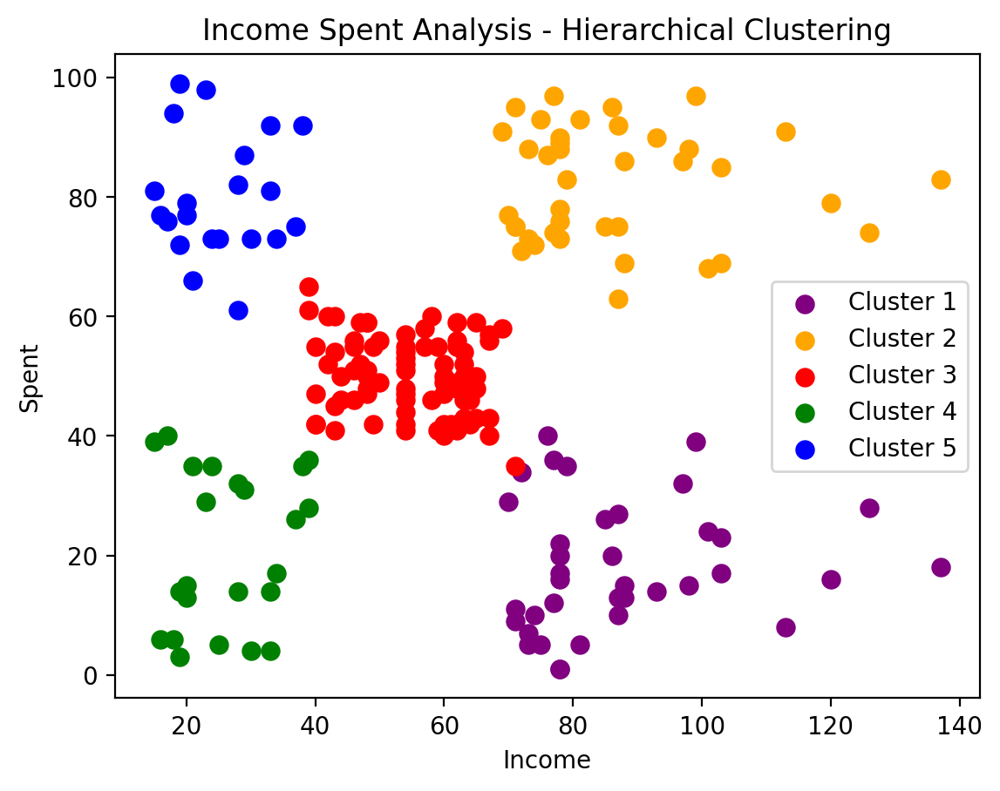

Clustering Income Spent Using Hierarchical Clustering
======================================================

Project Overview:
-------------------
The "Clustering Income Spent Using Hierarchical Clustering" project employs Hierarchical Clustering to segment customers based on income and spending behavior. 
It preprocesses data, visualizes the dendrogram tree graph to determine cluster count, and performs Agglomerative Clustering. 
Technical highlights include dendrogram visualization for cluster count determination and scatter plot visualization of clustered data.

Visualizes the dendrogram tree graph to determine cluster count
----------------------------------------------------------------

Clustered data
---------------

