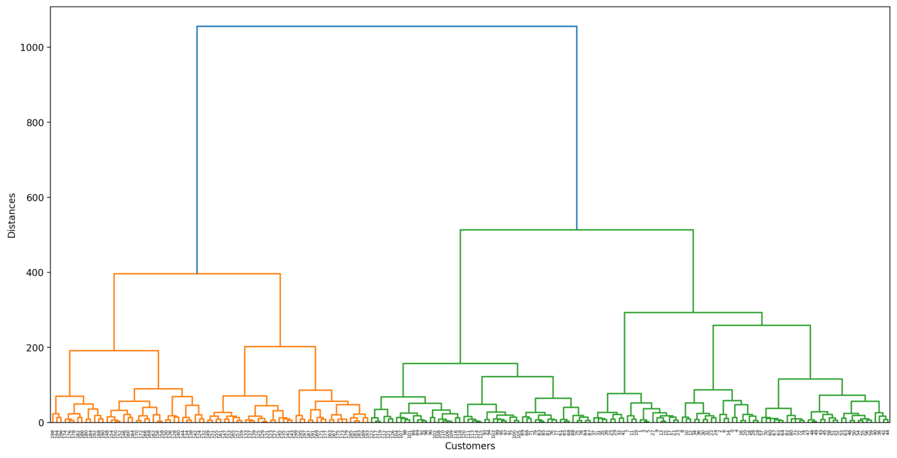
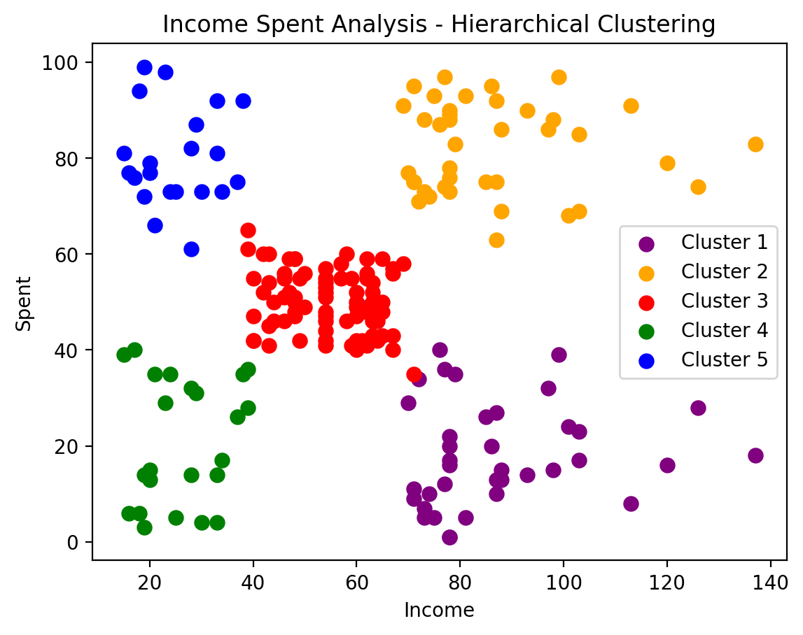

.. Clustering Income Spent Using Hierarchical Clustering documentation master file, created by
   sphinx-quickstart on Wed Apr 17 23:23:54 2024.
   You can adapt this file completely to your liking, but it should at least
   contain the root `toctree` directive.

Clustering Income Spent Using Hierarchical Clustering
======================================================

.. toctree::
   :maxdepth: 2
   :caption: Contents:

Project Overview:
-------------------
The "Clustering Income Spent Using Hierarchical Clustering" project employs Hierarchical Clustering to segment customers based on income and spending behavior. 
It preprocesses data, visualizes the dendrogram tree graph to determine cluster count, and performs Agglomerative Clustering. 
Technical highlights include dendrogram visualization for cluster count determination and scatter plot visualization of clustered data.

Code
------------------------

.. literalinclude:: C:/Users/USER/Documents/My GitHub Folder/Machine Learning Project/Machine-Learning-Projects/2. Unsupervised Learning/2. Hierarchical Clustering/Income & Spent Analysis .py
   :language: python

Visualizes the dendrogram tree graph to determine cluster count
----------------------------------------------------------------

Clustered data
---------------

